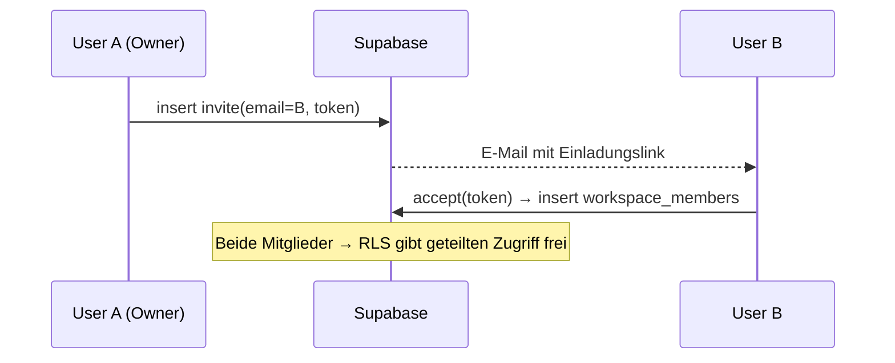

# Life OS — Auth & Workspace

## Authentifizierung

- **Supabase Auth** mit E-Mail/Passwort (später Magic-Link/OAuth).
- Session-State in `lib/core/auth.svelte.ts` (Svelte 5 Runes).
- **Auth-Guard** im `+layout.svelte`: ohne Session → `/login`.

## Workspace-Modell (Sharing zu zweit)

Ein **Workspace** ist der geteilte Datenraum. Mitgliedschaft regelt RLS
(siehe [[LifeOS_Datenmodell|Datenmodell & RLS]]).

### Ablauf

1. **Registrierung** → beim ersten Login automatisch ein eigener Workspace (Onboarding).
2. **Einladung:** Owner trägt Partner-E-Mail ein → `invites`-Row + E-Mail (Edge Function).
3. **Annahme:** Partner akzeptiert → Eintrag in `workspace_members` → beide teilen den
   Datenraum in Echtzeit.
4. **Austritt/Trennung:** Mitgliedschaft entfernen → RLS isoliert die Daten sofort wieder.

> [!note] Generalisiert das FairShare-Verpartnerungsprinzip
> Statt eines 1:1-Handshakes ein echter Multi-Tenant-Workspace: **KISS für 2 Personen,
> offen für N Mitglieder/Kunden (SaaS)** ohne Umbau.

## Rollen

- `owner` — verwaltet Mitglieder, später Plan/Billing.
- `member` — voller Zugriff auf geteilte Module; persönliche Daten (Journal) bleiben privat.

## Verknüpft

- [[LifeOS_Datenmodell|Datenmodell & RLS]]
- [[LifeOS_Sicherheit|Sicherheit & Datenschutz]]
- [[LifeOS_Deployment|Deployment]] (SaaS-Ausbau)
