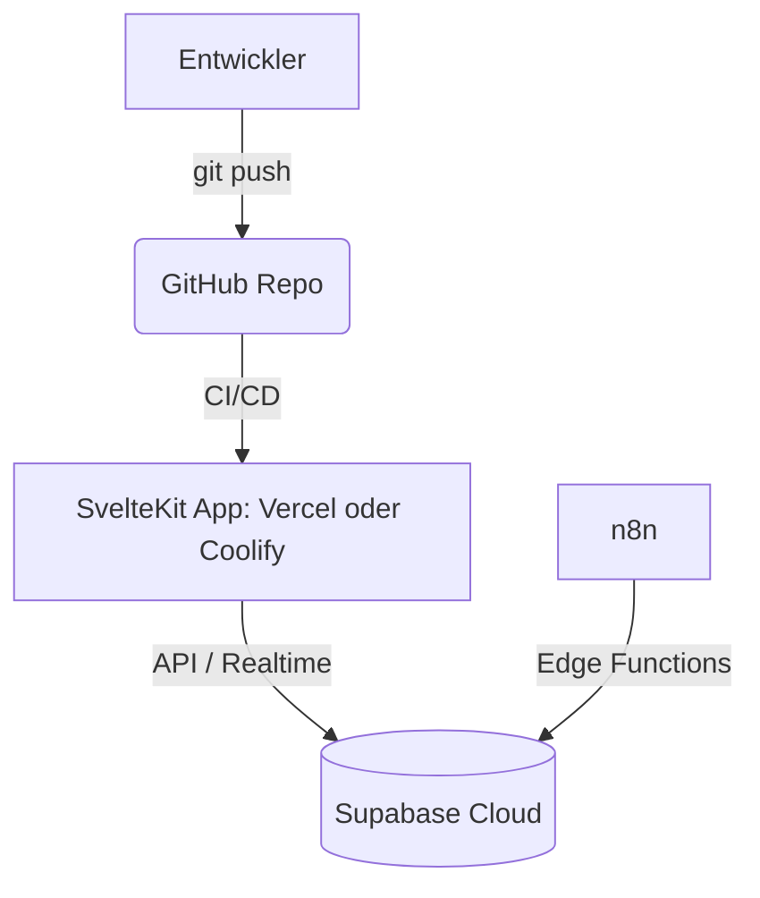

# Life OS — Deployment & Tooling

## Zielarchitektur

- **Backend:** Supabase Cloud (Postgres, Auth, RLS, Realtime, Storage, Edge Functions).
- **Frontend:** SvelteKit
  - **Empfohlen (KISS):** Vercel mit `@sveltejs/adapter-vercel`.
  - **Self-Host-Variante:** Coolify + `@sveltejs/adapter-node` (wie FairShare).
- **Automatisierung:** n8n (Cloud oder Self-Host), ruft Edge Functions.

## Umgebungen

- `local` (Supabase CLI / Branch-DB), `staging`, `production`.
- Secrets nur in Plattform-Env / n8n-Credentials, nie im Repo.

## CI/CD

- Push auf `main` → Build + Deploy (Vercel automatisch, oder Coolify-Webhook).
- Migrations über `supabase db push` / CI-Schritt, versioniert in `supabase/migrations/`.

## Tooling & Qualität

- **Tests:** Vitest (Recurrence/Aggregation), Playwright (Mobile-E2E 320–430px).
- **Lint/Format:** ESLint + Prettier.
- **Validierung:** Zod-Schemas geteilt zwischen Client und Edge Functions.

## SaaS-Ausbau (vorbereitet, nicht überbaut)

- Multi-Tenant (workspace) ab Tag 1 → kein Umbau.
- `plan`-Feld + Feature-Flags über die Modul-Registry → Module pro Plan freischalten (OCP).
- **Stripe** später via Edge Function + Webhooks; Workspace-Limits erzwingbar.

## Verknüpft

- [[LifeOS_Architektur|Architektur]]
- [[LifeOS_Sicherheit|Sicherheit & Datenschutz]]
- [[LifeOS_Roadmap|Roadmap]]
