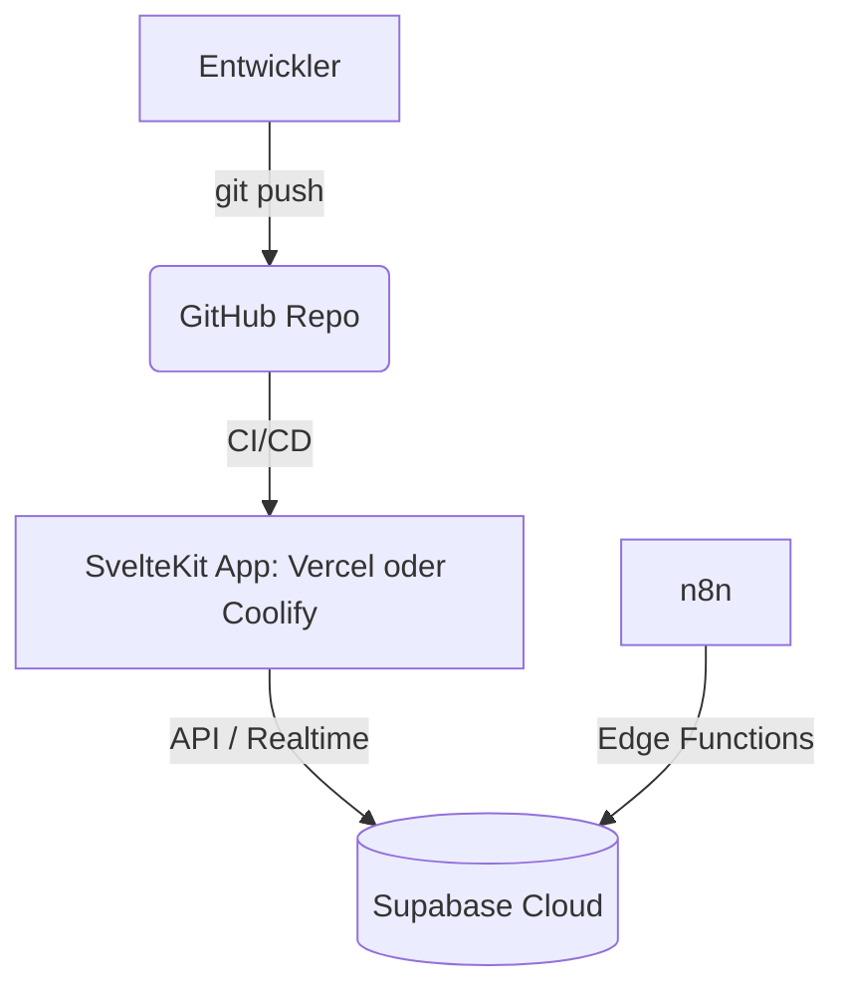

# Life OS — Deployment & Tooling

## Zielarchitektur


```mermaid
graph TD
    A[Entwickler] -->|git push| B(GitHub Repo)
    B -->|CI/CD| C[SvelteKit App: Vercel oder Coolify]
    C -->|API / Realtime| D[(Supabase Cloud)]
    E[n8n] -->|Edge Functions| D
```

- **Backend:** Supabase Cloud (Postgres, Auth, RLS, Realtime, Storage, Edge Functions).
- **Frontend:** SvelteKit
  - **Empfohlen (KISS):** Vercel mit `@sveltejs/adapter-vercel`.
  - **Self-Host-Variante:** Coolify + `@sveltejs/adapter-node` (wie FairShare).
- **Automatisierung:** n8n (Cloud oder Self-Host), ruft Edge Functions.

## Umgebungen

- `local` (Supabase CLI / Branch-DB), `staging`, `production`.
- Secrets nur in Plattform-Env / n8n-Credentials, nie im Repo.

## CI/CD

- Push auf `main` → Build + Deploy (Vercel automatisch, oder Coolify-Webhook).
- Migrations über `supabase db push` / CI-Schritt, versioniert in `supabase/migrations/`.

## Edge Functions — manuelle Schritte

Migrationen legen nur Datenbankobjekte an. Die Functions selbst und ihre Secrets müssen
einmalig von Hand deployt werden.

### `lifeos-reminder-dispatch` (Erinnerungen)

Ohne diesen Schritt feuert **keine** Erinnerung — die Function existiert, wird aber nicht
aufgerufen.

```bash
supabase functions deploy lifeos-reminder-dispatch
supabase secrets set LIFEOS_INTAKE_TOKEN=<token> VAPID_KEYS_JWK='<jwk>' VAPID_CONTACT=mailto:…
```

Danach im SQL-Editor die beiden Werte in die Vault legen (sie stehen bewusst nicht in der
Migration, damit kein Secret im Repo landet) und erst dann Migration `33` anwenden:

```sql
select vault.create_secret('https://<projekt>.supabase.co', 'lifeos_functions_url');
select vault.create_secret('<LIFEOS_INTAKE_TOKEN>',         'lifeos_intake_token');
```

Prüfen:

```sql
select jobname, schedule, active from cron.job where jobname = 'lifeos-reminder-dispatch';
select * from cron.job_run_details order by start_time desc limit 5;  -- status = 'succeeded'
```

`pg_cron` und `pg_net` müssen in der Instanz erlaubt sein (Supabase Cloud: Database →
Extensions). Bei Self-Hosting gehört `pg_cron` zusätzlich in `shared_preload_libraries`.

### `lifeos-account-delete` (Konto löschen)

```bash
supabase functions deploy lifeos-account-delete
```

Braucht keine eigenen Secrets: `SUPABASE_URL` und `SUPABASE_SERVICE_ROLE_KEY` setzt die
Plattform selbst. Die Function prüft das JWT des Aufrufers und löscht ausschließlich dessen
eigenes Konto; die Datenlöschung läuft über die `on delete cascade`-Ketten aus Migration 12.

## Tooling & Qualität

- **Tests:** Vitest (Recurrence/Aggregation), Playwright (Mobile-E2E 320–430px).
- **Lint/Format:** ESLint + Prettier.
- **Validierung:** Zod-Schemas geteilt zwischen Client und Edge Functions.

## SaaS-Ausbau (vorbereitet, nicht überbaut)

- Multi-Tenant (workspace) ab Tag 1 → kein Umbau.
- `plan`-Feld + Feature-Flags über die Modul-Registry → Module pro Plan freischalten (OCP).
- **Stripe** später via Edge Function + Webhooks; Workspace-Limits erzwingbar.

## Verknüpft

- [[LifeOS_Architektur|Architektur]]
- [[LifeOS_Sicherheit|Sicherheit & Datenschutz]]
- [[LifeOS_Roadmap|Roadmap]]
