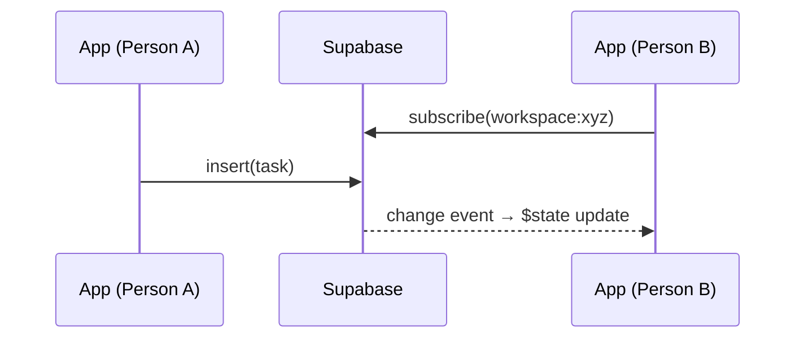

# Life OS — PWA, Offline & Realtime

> [!note] Kern-Philosophie
> Life OS verhält sich auf dem Smartphone wie eine native App (Homescreen, kein Browser-UI),
> funktioniert offline und hält beide Personen über Realtime ohne Reload synchron.

## PWA / Installierbarkeit

- **`@vite-pwa/sveltekit`** generiert Service Worker + Web App Manifest.
- Manifest: Theme `#f8fafc` (slate-50), Icons `pwa-192x192.png`, `pwa-512x512.png` + maskable.
- **App-Shell-Precache** für statische Assets → schnelle Starts.

## Realtime (statt SSE)

- **Supabase Realtime** (`postgres_changes`) pro **Workspace-Channel**.
- Eingehende Events aktualisieren den Svelte-5-Runes-State direkt → kein Reload.
- Abonnement gekapselt in `core/realtime.ts`, von den Feature-Stores genutzt.

## Offline-Outbox

- Mutationen landen in einer **IndexedDB**-Queue (`core/outbox.ts`).
- **Replay bei Reconnect**, sichtbarer **Sync-Status** in der UI.
- **Optimistic UI** für Häkchen (Aufgaben/Einkauf) → fühlt sich nativ an.

> [!warning] Offline-Sicherheit
> - Queue **nutzerbezogen** speichern, bei **Logout leeren**
> - keine Vermischung zwischen Nutzern
> - Konflikte **nicht still** überschreiben — Status anzeigen
> - IndexedDB statt `localStorage`

## Relevante Dateien (geplant)

- `vite.config.ts` (PWA-Setup)
- `src/lib/core/realtime.ts` (Channel-Abo)
- `src/lib/core/outbox.ts` (Offline-Queue + Replay)

## Verknüpft

- [[LifeOS_Architektur|Architektur]]
- [[LifeOS_Sicherheit|Sicherheit & Datenschutz]]
